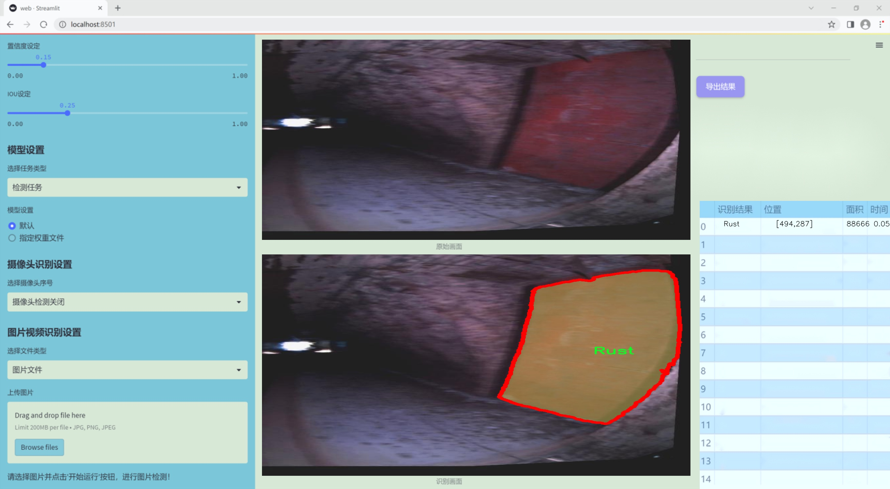

### 1.背景意义

研究背景与意义

随着工业化进程的加快，轮胎和轮毂的腐蚀问题日益严重，直接影响到车辆的安全性和使用寿命。腐蚀不仅会导致材料强度下降，还可能引发更为严重的机械故障，进而危及驾驶安全。因此，及时、准确地检测轮胎和轮毂的腐蚀状况，成为了汽车维护和管理中的重要任务。传统的人工检测方法不仅耗时耗力，而且容易受到人为因素的影响，导致检测结果的不准确性。因此，基于计算机视觉的自动化检测技术应运而生，成为解决这一问题的有效手段。

近年来，深度学习技术的快速发展为图像处理和物体检测提供了新的思路。YOLO（You Only Look Once）系列模型因其高效的实时检测能力而受到广泛关注。YOLOv11作为该系列的最新版本，结合了多种先进的网络结构和算法优化，能够在复杂环境中实现高精度的目标检测与分割。通过对YOLOv11进行改进，我们可以针对轮胎和轮毂的腐蚀特征，设计出更为精确的图像分割系统，从而提高检测的准确性和效率。

本研究基于一个包含6200张图像的腐蚀数据集，数据集中标注了两类目标：生锈（Rust）和腐蚀（corrosion）。通过对这些图像进行深度学习训练，我们旨在构建一个高效的图像分割系统，能够自动识别和定位轮胎和轮毂上的腐蚀区域。这不仅能够提高检测的效率，还能为后续的维护决策提供数据支持，降低安全隐患。此外，该系统的成功应用将为其他领域的腐蚀检测提供借鉴，推动相关技术的进一步发展。因此，本研究具有重要的理论意义和实际应用价值。

### 2.视频效果

[2.1 视频效果](https://www.bilibili.com/video/BV1kZkCY3E1v/)

### 3.图片效果




##### [项目涉及的源码数据来源链接](https://kdocs.cn/l/cszuIiCKVNis)**

注意：本项目提供训练的数据集和训练教程,由于版本持续更新,暂不提供权重文件（best.pt）,请按照6.训练教程进行训练后实现上图演示的效果。

### 4.数据集信息

##### 4.1 本项目数据集类别数＆类别名

nc: 2
names: ['Rust', 'corrosion']


该项目为【图像分割】数据集，请在【训练教程和Web端加载模型教程（第三步）】这一步的时候按照【图像分割】部分的教程来训练

##### 4.2 本项目数据集信息介绍

本项目数据集信息介绍

本项目旨在开发一个改进版的YOLOv11模型，以实现对轮胎轮毂腐蚀的高效检测与图像分割。为此，我们构建了一个专门针对“rust”主题的数据集，该数据集包含了与轮胎轮毂腐蚀相关的多种图像，旨在为模型的训练提供丰富的样本支持。数据集中包含两个主要类别，分别为“Rust”和“corrosion”，这两个类别涵盖了轮胎轮毂表面可能出现的不同腐蚀现象。

在数据集的构建过程中，我们收集了大量的高质量图像，确保每个类别的样本具有足够的多样性和代表性。这些图像不仅包括不同光照条件下的轮胎轮毂，还涵盖了多种角度和背景，以增强模型的鲁棒性。通过对图像进行精细的标注，我们为每个类别提供了准确的边界框和分割掩码，使得模型能够有效地学习到腐蚀的特征和形态。

此外，数据集还考虑到了不同程度的腐蚀现象，涵盖了从轻微锈蚀到严重腐蚀的多种情况。这种多样性不仅提高了模型的泛化能力，也为后续的实际应用提供了更为可靠的基础。通过对这些图像的分析与处理，我们期望能够提升YOLOv11在轮胎轮毂腐蚀检测任务中的性能，使其在实际应用中能够快速、准确地识别和分割出腐蚀区域，从而为轮胎的安全性和可靠性提供有力保障。总之，本数据集的构建为改进YOLOv11模型提供了坚实的基础，助力于实现高效的轮胎轮毂腐蚀检测与图像分割。


### 5.全套项目环境部署视频教程（零基础手把手教学）

[5.1 所需软件PyCharm和Anaconda安装教程（第一步）](https://www.bilibili.com/video/BV1BoC1YCEKi/?spm_id_from=333.999.0.0&vd_source=bc9aec86d164b67a7004b996143742dc)


[5.2 安装Python虚拟环境创建和依赖库安装视频教程（第二步）](https://www.bilibili.com/video/BV1ZoC1YCEBw?spm_id_from=333.788.videopod.sections&vd_source=bc9aec86d164b67a7004b996143742dc)

### 6.改进YOLOv11训练教程和Web_UI前端加载模型教程（零基础手把手教学）

[6.1 改进YOLOv11训练教程和Web_UI前端加载模型教程（第三步）](https://www.bilibili.com/video/BV1BoC1YCEhR?spm_id_from=333.788.videopod.sections&vd_source=bc9aec86d164b67a7004b996143742dc)


按照上面的训练视频教程链接加载项目提供的数据集，运行train.py即可开始训练



     Epoch   gpu_mem       box       obj       cls    labels  img_size
     1/200     20.8G   0.01576   0.01955  0.007536        22      1280: 100%|██████████| 849/849 [14:42<00:00,  1.04s/it]
               Class     Images     Labels          P          R     mAP@.5 mAP@.5:.95: 100%|██████████| 213/213 [01:14<00:00,  2.87it/s]
                 all       3395      17314      0.994      0.957      0.0957      0.0843

     Epoch   gpu_mem       box       obj       cls    labels  img_size
     2/200     20.8G   0.01578   0.01923  0.007006        22      1280: 100%|██████████| 849/849 [14:44<00:00,  1.04s/it]
               Class     Images     Labels          P          R     mAP@.5 mAP@.5:.95: 100%|██████████| 213/213 [01:12<00:00,  2.95it/s]
                 all       3395      17314      0.996      0.956      0.0957      0.0845

     Epoch   gpu_mem       box       obj       cls    labels  img_size
     3/200     20.8G   0.01561    0.0191  0.006895        27      1280: 100%|██████████| 849/849 [10:56<00:00,  1.29it/s]
               Class     Images     Labels          P          R     mAP@.5 mAP@.5:.95: 100%|███████   | 187/213 [00:52<00:00,  4.04it/s]
                 all       3395      17314      0.996      0.957      0.0957      0.0845


###### [项目数据集下载链接](https://kdocs.cn/l/cszuIiCKVNis)

### 7.原始YOLOv11算法讲解


##### YOLOv11三大损失函数

YOLOv11（You Only Look Once）是一种流行的目标检测算法，其损失函数设计用于同时优化分类和定位任务。YOLO的损失函数通常包括几个部分：
**分类损失、定位损失（边界框回归损失）和置信度损失** 。其中，

  1. box_loss（边界框回归损失）是用于优化预测边界框与真实边界框之间的差异的部分。

  2. cls_loss（分类损失）是用于优化模型对目标类别的预测准确性的部分。分类损失确保模型能够正确地识别出图像中的对象属于哪个类别。

  3. dfl_loss（Distribution Focal Loss）是YOLO系列中的一种损失函数，特别是在一些改进版本如YOLOv5和YOLOv7中被引入。它的主要目的是解决目标检测中的类别不平衡问题，并提高模型在处理小目标和困难样本时的性能。

##### 边界框回归损失详解

box_loss（边界框回归损失）是用于优化预测边界框与真实边界框之间的差异的部分。


##### box_loss 的具体意义


##### 为什么需要 box_loss

  * 精确定位：通过最小化中心点坐标损失和宽高损失，模型能够更准确地预测目标的位置和大小。
  * 平衡不同类型的目标：使用平方根来处理宽高损失，可以更好地平衡不同大小的目标，确保小目标也能得到足够的关注。
  * 稳定训练：适当的损失函数设计有助于模型的稳定训练，避免梯度爆炸或消失等问题。

##### 分类损失详解

在YOLO（You Only Look
Once）目标检测算法中，cls_loss（分类损失）是用于优化模型对目标类别的预测准确性的部分。分类损失确保模型能够正确地识别出图像中的对象属于哪个类别。下面是关于cls_loss的详细解读：

##### 分类损失 (cls_loss) 的具体意义

  
分类损失通常使用交叉熵损失（Cross-Entropy
Loss）来计算。交叉熵损失衡量的是模型预测的概率分布与真实标签之间的差异。在YOLO中，分类损失的具体形式如下：


##### 为什么需要 cls_loss

  * 类别识别：cls_loss 确保模型能够正确识别出图像中的目标属于哪个类别。这对于目标检测任务至关重要，因为不仅需要知道目标的位置，还需要知道目标的类型。

  * 多类别支持：通过最小化分类损失，模型可以处理多个类别的目标检测任务。例如，在道路缺陷检测中，可能需要识别裂缝、坑洞、路面破损等多种类型的缺陷。

  * 提高准确性：分类损失有助于提高模型的分类准确性，从而提升整体检测性能。通过优化分类损失，模型可以更好地学习不同类别之间的特征差异。

##### 分布损失详解

`dfl_loss`（Distribution Focal
Loss）是YOLO系列中的一种损失函数，特别是在一些改进版本如YOLOv5和YOLOv7中被引入。它的主要目的是解决目标检测中的类别不平衡问题，并提高模型在处理小目标和困难样本时的性能。下面是对`dfl_loss`的详细解读：

##### DFL Loss 的背景

在目标检测任务中，类别不平衡是一个常见的问题。某些类别的样本数量可能远远多于其他类别，这会导致模型在训练过程中对常见类别的学习效果较好，而对罕见类别的学习效果较差。此外，小目标和困难样本的检测也是一个挑战，因为这些目标通常具有较少的特征信息，容易被忽略或误分类。

为了应对这些问题，研究者们提出了多种改进方法，其中之一就是`dfl_loss`。`dfl_loss`通过引入分布焦点损失来增强模型对困难样本的关注，并改善类别不平衡问题。

##### DFL Loss 的定义

DFL Loss
通常与传统的交叉熵损失结合使用，以增强模型对困难样本的学习能力。其核心思想是通过对每个类别的预测概率进行加权，使得模型更加关注那些难以正确分类的样本。

DFL Loss 的公式可以表示为：


##### DFL Loss 的具体意义**

  * **类别不平衡：** 通过引入平衡因子 α，DFL Loss 可以更好地处理类别不平衡问题。对于少数类别的样本，可以通过增加其权重来提升其重要性，从而提高模型对这些类别的检测性能。
  *  **困难样本：** 通过聚焦参数 γ，DFL Loss 可以让模型更加关注那些难以正确分类的样本。当 
  * γ 较大时，模型会对那些预测概率较低的样本给予更多的关注，从而提高这些样本的分类准确性。
  *  **提高整体性能** ：DFL Loss 结合了传统交叉熵损失的优势，并通过加权机制增强了模型对困难样本的学习能力，从而提高了整体的检测性能。


### 8.200+种全套改进YOLOV11创新点原理讲解

#### 8.1 200+种全套改进YOLOV11创新点原理讲解大全

由于篇幅限制，每个创新点的具体原理讲解就不全部展开，具体见下列网址中的改进模块对应项目的技术原理博客网址【Blog】（创新点均为模块化搭建，原理适配YOLOv5~YOLOv11等各种版本）

[改进模块技术原理博客【Blog】网址链接](https://gitee.com/qunmasj/good)


#### 8.2 精选部分改进YOLOV11创新点原理讲解

###### 这里节选部分改进创新点展开原理讲解(完整的改进原理见上图和[改进模块技术原理博客链接](https://gitee.com/qunmasj/good)【如果此小节的图加载失败可以通过CSDN或者Github搜索该博客的标题访问原始博客，原始博客图片显示正常】

### 动态蛇形卷积Dynamic Snake Convolution

参考论文： 2307.08388.pdf (arxiv.org)

血管、道路等拓扑管状结构的精确分割在各个领域都至关重要，确保下游任务的准确性和效率。 然而，许多因素使任务变得复杂，包括薄的局部结构和可变的全局形态。在这项工作中，我们注意到管状结构的特殊性，并利用这些知识来指导我们的 DSCNet 在三个阶段同时增强感知：特征提取、特征融合、 和损失约束。 首先，我们提出了一种动态蛇卷积，通过自适应地关注细长和曲折的局部结构来准确捕获管状结构的特征。 随后，我们提出了一种多视图特征融合策略，以补充特征融合过程中多角度对特征的关注，确保保留来自不同全局形态的重要信息。 最后，提出了一种基于持久同源性的连续性约束损失函数，以更好地约束分割的拓扑连续性。 2D 和 3D 数据集上的实验表明，与多种方法相比，我们的 DSCNet 在管状结构分割任务上提供了更好的准确性和连续性。 我们的代码是公开的。 
主要的挑战源于细长微弱的局部结构特征与复杂多变的全局形态特征。本文关注到管状结构细长连续的特点，并利用这一信息在神经网络以下三个阶段同时增强感知：特征提取、特征融合和损失约束。分别设计了动态蛇形卷积（Dynamic Snake Convolution），多视角特征融合策略与连续性拓扑约束损失。 

我们希望卷积核一方面能够自由地贴合结构学习特征，另一方面能够在约束条件下不偏离目标结构太远。在观察管状结构的细长连续的特征后，脑海里想到了一个动物——蛇。我们希望卷积核能够像蛇一样动态地扭动，来贴合目标的结构。

我们希望卷积核一方面能够自由地贴合结构学习特征，另一方面能够在约束条件下不偏离目标结构太远。在观察管状结构的细长连续的特征后，脑海里想到了一个动物——蛇。我们希望卷积核能够像蛇一样动态地扭动，来贴合目标的结构。


### DCNV2融入YOLOv11
DCN和DCNv2（可变性卷积）
网上关于两篇文章的详细描述已经很多了，我这里具体的细节就不多讲了，只说一下其中实现起来比较困惑的点。（黑体字会讲解）

DCNv1解决的问题就是我们常规的图像增强，仿射变换（线性变换加平移）不能解决的多种形式目标变换的几何变换的问题。如下图所示。

可变性卷积的思想很简单，就是讲原来固定形状的卷积核变成可变的。如下图所示：


首先来看普通卷积，以3x3卷积为例对于每个输出y(p0)，都要从x上采样9个位置，这9个位置都在中心位置x(p0)向四周扩散得到的gird形状上，(-1,-1)代表x(p0)的左上角，(1,1)代表x(p0)的右下角，其他类似。

用公式表示如下：


可变性卷积Deformable Conv操作并没有改变卷积的计算操作，而是在卷积操作的作用区域上，加入了一个可学习的参数∆pn。同样对于每个输出y(p0)，都要从x上采样9个位置，这9个位置是中心位置x(p0)向四周扩散得到的，但是多了 ∆pn，允许采样点扩散成非gird形状。


偏移量是通过对原始特征层进行卷积得到的。比如输入特征层是w×h×c，先对输入的特征层进行卷积操作，得到w×h×2c的offset field。这里的w和h和原始特征层的w和h是一致的，offset field里面的值是输入特征层对应位置的偏移量，偏移量有x和y两个方向，所以offset field的channel数是2c。offset field里的偏移量是卷积得到的，可能是浮点数，所以接下来需要通过双向性插值计算偏移位置的特征值。在偏移量的学习中，梯度是通过双线性插值来进行反向传播的。
看到这里是不是还是有点迷茫呢？那到底程序上面怎么实现呢？


事实上由上面的公式我们可以看得出来∆pn这个偏移量是加在原像素点上的，但是我们怎么样从代码上对原像素点加这个量呢？其实很简单，就是用一个普通的卷积核去跟输入图片（一般是输入的feature_map）卷积就可以了卷积核的数量是2N也就是23*3==18（前9个通道是x方向的偏移量，后9个是y方向的偏移量），然后把这个卷积的结果与正常卷积的结果进行相加就可以了。
然后又有了第二个问题，怎么样反向传播呢？为什么会有这个问题呢？因为求出来的偏移量+正常卷积输出的结果往往是一个浮点数，浮点数是无法对应到原图的像素点的，所以自然就想到了双线性差值的方法求出浮点数对应的浮点像素点。


#### DCN v2
对于positive的样本来说，采样的特征应该focus在RoI内，如果特征中包含了过多超出RoI的内容，那么结果会受到影响和干扰。而negative样本则恰恰相反，引入一些超出RoI的特征有助于帮助网络判别这个区域是背景区域。

DCNv1引入了可变形卷积，能更好的适应目标的几何变换。但是v1可视化结果显示其感受野对应位置超出了目标范围，导致特征不受图像内容影响（理想情况是所有的对应位置分布在目标范围以内）。

为了解决该问题：提出v2, 主要有

1、扩展可变形卷积，增强建模能力
2、提出了特征模拟方案指导网络培训：feature mimicking scheme

上面这段话是什么意思呢，通俗来讲就是，我们的可变性卷积的区域大于目标所在区域，所以这时候就会对非目标区域进行错误识别。

所以自然能想到的解决方案就是加入权重项进行惩罚。（至于这个实现起来就比较简单了，直接初始化一个权重然后乘(input+offsets)就可以了）


可调节的RoIpooling也是类似的，公式如下：


### 9.系统功能展示

图9.1.系统支持检测结果表格显示

  图9.2.系统支持置信度和IOU阈值手动调节

  图9.3.系统支持自定义加载权重文件best.pt(需要你通过步骤5中训练获得)

  图9.4.系统支持摄像头实时识别

  图9.5.系统支持图片识别

  图9.6.系统支持视频识别

  图9.7.系统支持识别结果文件自动保存

  图9.8.系统支持Excel导出检测结果数据


### 10. YOLOv11核心改进源码讲解

#### 10.1 VanillaNet.py

以下是对代码的逐文件分析，保留了最核心的部分，并进行了详细的中文注释：

```python
import torch
import torch.nn as nn
import torch.nn.functional as F
from timm.layers import weight_init

# 定义激活函数类
class Activation(nn.ReLU):
    def __init__(self, dim, act_num=3, deploy=False):
        super(Activation, self).__init__()
        self.deploy = deploy  # 是否处于部署模式
        # 权重初始化
        self.weight = torch.nn.Parameter(torch.randn(dim, 1, act_num * 2 + 1, act_num * 2 + 1))
        self.bias = None
        self.bn = nn.BatchNorm2d(dim, eps=1e-6)  # 批归一化
        self.dim = dim
        self.act_num = act_num
        weight_init.trunc_normal_(self.weight, std=.02)  # 权重截断正态初始化

    def forward(self, x):
        # 前向传播
        if self.deploy:
            return torch.nn.functional.conv2d(
                super(Activation, self).forward(x), 
                self.weight, self.bias, padding=(self.act_num * 2 + 1) // 2, groups=self.dim)
        else:
            return self.bn(torch.nn.functional.conv2d(
                super(Activation, self).forward(x),
                self.weight, padding=self.act_num, groups=self.dim))

    def switch_to_deploy(self):
        # 切换到部署模式
        if not self.deploy:
            kernel, bias = self._fuse_bn_tensor(self.weight, self.bn)
            self.weight.data = kernel
            self.bias = torch.nn.Parameter(torch.zeros(self.dim))
            self.bias.data = bias
            self.__delattr__('bn')  # 删除bn属性
            self.deploy = True

# 定义基本块
class Block(nn.Module):
    def __init__(self, dim, dim_out, act_num=3, stride=2, deploy=False):
        super().__init__()
        self.deploy = deploy
        if self.deploy:
            self.conv = nn.Conv2d(dim, dim_out, kernel_size=1)  # 部署模式下的卷积
        else:
            self.conv1 = nn.Sequential(
                nn.Conv2d(dim, dim, kernel_size=1),
                nn.BatchNorm2d(dim, eps=1e-6),
            )
            self.conv2 = nn.Sequential(
                nn.Conv2d(dim, dim_out, kernel_size=1),
                nn.BatchNorm2d(dim_out, eps=1e-6)
            )
        self.pool = nn.MaxPool2d(stride) if stride != 1 else nn.Identity()  # 池化层
        self.act = Activation(dim_out, act_num)  # 激活函数

    def forward(self, x):
        # 前向传播
        if self.deploy:
            x = self.conv(x)
        else:
            x = self.conv1(x)
            x = F.leaky_relu(x, negative_slope=1)  # 使用Leaky ReLU激活
            x = self.conv2(x)

        x = self.pool(x)  # 池化
        x = self.act(x)  # 激活
        return x

# 定义VanillaNet模型
class VanillaNet(nn.Module):
    def __init__(self, in_chans=3, num_classes=1000, dims=[96, 192, 384, 768], 
                 drop_rate=0, act_num=3, strides=[2, 2, 2, 1], deploy=False):
        super().__init__()
        self.deploy = deploy
        if self.deploy:
            self.stem = nn.Sequential(
                nn.Conv2d(in_chans, dims[0], kernel_size=4, stride=4),
                Activation(dims[0], act_num)
            )
        else:
            self.stem1 = nn.Sequential(
                nn.Conv2d(in_chans, dims[0], kernel_size=4, stride=4),
                nn.BatchNorm2d(dims[0], eps=1e-6),
            )
            self.stem2 = nn.Sequential(
                nn.Conv2d(dims[0], dims[0], kernel_size=1, stride=1),
                nn.BatchNorm2d(dims[0], eps=1e-6),
                Activation(dims[0], act_num)
            )

        self.stages = nn.ModuleList()
        for i in range(len(strides)):
            stage = Block(dim=dims[i], dim_out=dims[i + 1], act_num=act_num, stride=strides[i], deploy=deploy)
            self.stages.append(stage)  # 添加基本块

    def forward(self, x):
        # 前向传播
        if self.deploy:
            x = self.stem(x)
        else:
            x = self.stem1(x)
            x = F.leaky_relu(x, negative_slope=1)
            x = self.stem2(x)

        for stage in self.stages:
            x = stage(x)  # 依次通过每个基本块
        return x

# 模型构建函数
def vanillanet_10(pretrained='', **kwargs):
    model = VanillaNet(dims=[128 * 4, 128 * 4, 256 * 4, 512 * 4, 512 * 4, 512 * 4, 512 * 4, 1024 * 4], strides=[1, 2, 2, 1, 1, 1, 2, 1], **kwargs)
    if pretrained:
        weights = torch.load(pretrained)['model_ema']
        model.load_state_dict(weights)  # 加载预训练权重
    return model

if __name__ == '__main__':
    inputs = torch.randn((1, 3, 640, 640))  # 输入数据
    model = vanillanet_10()  # 实例化模型
    pred = model(inputs)  # 前向传播
    for i in pred:
        print(i.size())  # 输出每层的输出尺寸
```

### 代码分析总结：
1. **Activation类**：自定义的激活函数类，包含权重和偏置的初始化，前向传播以及切换到部署模式的功能。
2. **Block类**：构建了一个基本的卷积块，包含卷积、批归一化、激活函数和池化操作。
3. **VanillaNet类**：整体网络结构，包含输入层、多个基本块和前向传播逻辑。
4. **vanillanet_10函数**：构建特定配置的VanillaNet模型，并可选择加载预训练权重。

该代码实现了一个卷积神经网络的基本结构，适用于图像分类等任务。

这个文件定义了一个名为 `VanillaNet` 的深度学习模型，主要用于图像处理任务。代码中使用了 PyTorch 框架，并且实现了一些特定的模块和功能。以下是对代码的逐步分析和说明。

首先，文件中引入了必要的库，包括 `torch` 和 `torch.nn`，这些是构建神经网络的基础库。`timm.layers` 提供了一些额外的层和初始化方法，`numpy` 则用于数值计算。

接下来，定义了一个名为 `activation` 的类，它继承自 `nn.ReLU`。这个类实现了一个自定义的激活函数，具有可学习的权重和偏置。它的构造函数中初始化了权重和批归一化层，并在前向传播中根据是否处于部署模式选择不同的计算方式。`switch_to_deploy` 方法用于将模型切换到部署模式，这样可以合并批归一化层以提高推理速度。

然后，定义了一个 `Block` 类，它是模型的基本构建块。每个块包含两个卷积层和一个激活层。根据是否处于部署模式，前向传播的实现会有所不同。该类还包含池化层，池化方式根据步幅决定，支持自适应池化。`switch_to_deploy` 方法在此类中也用于将块切换到部署模式。

`VanillaNet` 类是整个模型的核心部分。它在初始化时接受输入通道数、类别数、特征维度、丢弃率、激活函数数量、步幅等参数。根据这些参数，构建了一个由多个 `Block` 组成的网络结构。模型的前向传播方法将输入数据通过各个阶段处理，并根据输入尺寸记录特征图。

在 `VanillaNet` 中，还实现了权重初始化的 `_init_weights` 方法，以及用于更新模型权重的 `update_weight` 函数。这个函数会检查权重字典中的键是否在模型字典中，并且形状是否匹配，然后更新模型的权重。

接下来，定义了一系列的函数（如 `vanillanet_5` 到 `vanillanet_13_x1_5_ada_pool`），这些函数用于创建不同配置的 `VanillaNet` 模型，并可以选择加载预训练权重。这些函数的参数包括是否使用预训练权重等。

最后，在 `__main__` 块中，创建了一个随机输入并实例化了 `vanillanet_10` 模型，随后通过模型进行前向传播并打印输出特征图的尺寸。

总体来说，这个文件实现了一个灵活的卷积神经网络架构，支持多种配置和部署模式，适合用于图像分类等任务。通过自定义的激活函数和模块化的设计，模型能够在训练和推理阶段表现出不同的特性。

#### 10.2 cfpt.py

以下是代码中最核心的部分，并附上详细的中文注释：

```python
import torch
import torch.nn as nn
import torch.nn.functional as F
from timm.layers import to_2tuple, trunc_normal_

class CrossLayerPosEmbedding3D(nn.Module):
    def __init__(self, num_heads=4, window_size=(5, 3, 1), spatial=True):
        super(CrossLayerPosEmbedding3D, self).__init__()
        self.spatial = spatial  # 是否使用空间位置嵌入
        self.num_heads = num_heads  # 注意力头的数量
        self.layer_num = len(window_size)  # 层数

        # 初始化相对位置偏置表
        self.relative_position_bias_table = nn.Parameter(
            torch.zeros((2 * window_size[0] - 1) * (2 * window_size[0] - 1), num_heads)
        )
        # 计算相对位置索引
        self.register_buffer("relative_position_index", self._compute_relative_position_index(window_size))

        # 初始化绝对位置偏置
        self.absolute_position_bias = nn.Parameter(torch.zeros(len(window_size), num_heads, 1, 1, 1))
        trunc_normal_(self.relative_position_bias_table, std=.02)  # 初始化偏置表

    def _compute_relative_position_index(self, window_size):
        # 计算相对位置索引的辅助函数
        coords_h = [torch.arange(ws) - ws // 2 for ws in window_size]
        coords_w = [torch.arange(ws) - ws // 2 for ws in window_size]
        coords_flatten = torch.cat([torch.flatten(coord) for coord in coords_h + coords_w], dim=-1)
        relative_coords = coords_flatten[:, :, None] - coords_flatten[:, None, :]
        relative_coords = relative_coords.permute(1, 2, 0).contiguous()
        relative_coords[:, :, 0] += window_size[0] - 1
        relative_coords[:, :, 1] += window_size[0] - 1
        relative_coords[:, :, 0] *= 2 * window_size[0] - 1
        return relative_coords.sum(-1)

    def forward(self):
        # 前向传播，计算位置嵌入
        pos_indicies = self.relative_position_index.view(-1)
        pos_indicies_floor = torch.floor(pos_indicies).long()
        pos_indicies_ceil = torch.ceil(pos_indicies).long()
        value_floor = self.relative_position_bias_table[pos_indicies_floor]
        value_ceil = self.relative_position_bias_table[pos_indicies_ceil]
        weights_ceil = pos_indicies - pos_indicies_floor.float()
        weights_floor = 1.0 - weights_ceil

        pos_embed = weights_floor.unsqueeze(-1) * value_floor + weights_ceil.unsqueeze(-1) * value_ceil
        pos_embed = pos_embed.reshape(1, 1, -1, -1, self.num_heads).permute(0, 4, 1, 2, 3)

        return pos_embed

class CrossLayerSpatialAttention(nn.Module):
    def __init__(self, in_dim, layer_num=3, beta=1, num_heads=4, mlp_ratio=2, reduction=4):
        super(CrossLayerSpatialAttention, self).__init__()
        self.num_heads = num_heads  # 注意力头的数量
        self.hidden_dim = in_dim // reduction  # 隐藏层维度
        self.window_sizes = [(2 ** i + beta) if i != 0 else (2 ** i + beta - 1) for i in range(layer_num)][::-1]

        # 初始化卷积位置编码、层归一化、QKV卷积等
        self.cpe = nn.ModuleList([ConvPosEnc(dim=in_dim, k=3) for _ in range(layer_num)])
        self.qkv = nn.ModuleList(nn.Conv2d(in_dim, self.hidden_dim * 3, kernel_size=1) for _ in range(layer_num))
        self.norm1 = nn.ModuleList(LayerNormProxy(in_dim) for _ in range(layer_num))
        self.norm2 = nn.ModuleList(nn.LayerNorm(in_dim) for _ in range(layer_num))
        self.softmax = nn.Softmax(dim=-1)  # Softmax层
        self.proj = nn.ModuleList(nn.Conv2d(self.hidden_dim, in_dim, kernel_size=1) for _ in range(layer_num))
        self.pos_embed = CrossLayerPosEmbedding3D(num_heads=num_heads, window_size=self.window_sizes, spatial=True)

    def forward(self, x_list):
        # 前向传播，计算跨层空间注意力
        q_list, k_list, v_list = [], [], []
        for i, x in enumerate(x_list):
            x = self.cpe[i](x)  # 应用卷积位置编码
            qkv = self.qkv[i](x)  # 计算QKV
            q, k, v = qkv.chunk(3, dim=1)  # 分割QKV
            q_list.append(q)
            k_list.append(k)
            v_list.append(v)

        # 合并所有层的QKV
        q_stack = torch.cat(q_list, dim=1)
        k_stack = torch.cat(k_list, dim=1)
        v_stack = torch.cat(v_list, dim=1)

        # 计算注意力
        attn = F.normalize(q_stack, dim=-1) @ F.normalize(k_stack, dim=-1).transpose(-1, -2)
        attn = attn + self.pos_embed()  # 加入位置嵌入
        attn = self.softmax(attn)  # 应用Softmax

        # 计算输出
        out = attn @ v_stack
        out_list = []
        for i in range(len(x_list)):
            out_i = self.norm1[i](self.proj[i](out)) + x_list[i]  # 残差连接
            out_list.append(out_i)

        return out_list
```

### 代码说明：
1. **CrossLayerPosEmbedding3D**: 这个类负责计算跨层的3D位置嵌入，包括相对位置和绝对位置偏置。它在初始化时计算相对位置索引，并在前向传播中生成位置嵌入。

2. **CrossLayerSpatialAttention**: 这个类实现了跨层空间注意力机制。它通过多个层的输入计算Q、K、V，并使用Softmax计算注意力权重，最后结合位置嵌入和输入进行输出。

3. **前向传播**: 在`forward`方法中，输入的多个层通过卷积位置编码进行处理，计算Q、K、V，然后计算注意力权重并生成输出。

通过这些核心部分的实现，模型能够有效地进行跨层的空间注意力计算，增强特征表示能力。

这个程序文件 `cfpt.py` 实现了一个基于深度学习的模型，主要用于图像处理，特别是在图像特征提取和注意力机制方面。代码中定义了多个类和函数，以下是对其主要内容的讲解。

首先，导入了一些必要的库，包括 `torch`、`math`、`einops`、`torch.nn` 等，这些库提供了构建和训练神经网络所需的基本功能。

`LayerNormProxy` 类是一个简单的层归一化实现，它将输入张量的维度进行重排，以适应 `nn.LayerNorm` 的要求。`forward` 方法中，输入张量的形状从 `(b, c, h, w)` 转换为 `(b, h, w, c)`，然后进行归一化处理，最后再转换回原来的形状。

`CrossLayerPosEmbedding3D` 类用于生成跨层的三维位置嵌入。根据输入的窗口大小和头数，它计算相对位置偏置，并通过 `trunc_normal_` 函数初始化位置偏置表。`forward` 方法根据相对位置索引计算位置嵌入，并将其与绝对位置偏置结合。

`ConvPosEnc` 类实现了一个卷积位置编码模块，使用深度可分离卷积对输入进行处理，并可选择性地添加激活函数。

`DWConv` 类实现了深度卷积操作，适用于处理图像数据。

`Mlp` 类定义了一个多层感知机（MLP），包括两个线性层和一个激活函数，常用于特征变换。

接下来的几个函数 `overlaped_window_partition`、`overlaped_window_reverse`、`overlaped_channel_partition` 和 `overlaped_channel_reverse` 用于实现窗口划分和重组操作，这些操作在注意力机制中用于处理局部特征。

`CrossLayerSpatialAttention` 类实现了跨层空间注意力机制。它通过多个卷积层和注意力机制来提取图像特征。该类的构造函数中，定义了多个层级的窗口大小、步幅和填充，并初始化了必要的模块，包括位置编码、归一化层和多层感知机。在 `forward` 方法中，输入的特征图经过一系列处理，计算出注意力权重，并将其应用于输入特征，最终输出经过处理的特征图。

`CrossLayerChannelAttention` 类与 `CrossLayerSpatialAttention` 类类似，但它实现的是跨层通道注意力机制。它通过对输入特征进行通道划分和重组，计算通道间的注意力权重。与空间注意力不同，通道注意力更关注特征的通道维度。该类的构造函数和 `forward` 方法与空间注意力类似，但处理的重点在于通道而非空间。

总体而言，这个程序文件实现了一个复杂的深度学习模型，结合了卷积神经网络和注意力机制，旨在提高图像特征提取的效果。通过跨层的空间和通道注意力，模型能够更好地捕捉图像中的重要特征，从而在各种视觉任务中表现出色。

#### 10.3 lsknet.py

以下是保留的核心代码部分，并附上详细的中文注释：

```python
import torch
import torch.nn as nn
from functools import partial

class Mlp(nn.Module):
    """ 多层感知机（MLP）模块 """
    def __init__(self, in_features, hidden_features=None, out_features=None, act_layer=nn.GELU, drop=0.):
        super().__init__()
        out_features = out_features or in_features  # 输出特征数
        hidden_features = hidden_features or in_features  # 隐藏层特征数
        self.fc1 = nn.Conv2d(in_features, hidden_features, 1)  # 第一个卷积层
        self.dwconv = DWConv(hidden_features)  # 深度卷积层
        self.act = act_layer()  # 激活函数
        self.fc2 = nn.Conv2d(hidden_features, out_features, 1)  # 第二个卷积层
        self.drop = nn.Dropout(drop)  # Dropout层

    def forward(self, x):
        """ 前向传播 """
        x = self.fc1(x)  # 通过第一个卷积层
        x = self.dwconv(x)  # 通过深度卷积层
        x = self.act(x)  # 激活
        x = self.drop(x)  # Dropout
        x = self.fc2(x)  # 通过第二个卷积层
        x = self.drop(x)  # Dropout
        return x

class LSKblock(nn.Module):
    """ LSK块，包含多个卷积操作和注意力机制 """
    def __init__(self, dim):
        super().__init__()
        self.conv0 = nn.Conv2d(dim, dim, 5, padding=2, groups=dim)  # 深度卷积
        self.conv_spatial = nn.Conv2d(dim, dim, 7, stride=1, padding=9, groups=dim, dilation=3)  # 空间卷积
        self.conv1 = nn.Conv2d(dim, dim//2, 1)  # 1x1卷积
        self.conv2 = nn.Conv2d(dim, dim//2, 1)  # 1x1卷积
        self.conv_squeeze = nn.Conv2d(2, 2, 7, padding=3)  # 压缩卷积
        self.conv = nn.Conv2d(dim//2, dim, 1)  # 1x1卷积

    def forward(self, x):
        """ 前向传播 """
        attn1 = self.conv0(x)  # 第一个注意力分支
        attn2 = self.conv_spatial(attn1)  # 第二个注意力分支

        attn1 = self.conv1(attn1)  # 通过第一个1x1卷积
        attn2 = self.conv2(attn2)  # 通过第二个1x1卷积
        
        attn = torch.cat([attn1, attn2], dim=1)  # 拼接两个分支
        avg_attn = torch.mean(attn, dim=1, keepdim=True)  # 平均注意力
        max_attn, _ = torch.max(attn, dim=1, keepdim=True)  # 最大注意力
        agg = torch.cat([avg_attn, max_attn], dim=1)  # 拼接平均和最大注意力
        sig = self.conv_squeeze(agg).sigmoid()  # 通过压缩卷积并应用sigmoid
        attn = attn1 * sig[:,0,:,:].unsqueeze(1) + attn2 * sig[:,1,:,:].unsqueeze(1)  # 加权组合
        attn = self.conv(attn)  # 最终卷积
        return x * attn  # 输出与输入的加权组合

class LSKNet(nn.Module):
    """ LSK网络架构 """
    def __init__(self, img_size=224, in_chans=3, embed_dims=[64, 128, 256, 512],
                 mlp_ratios=[8, 8, 4, 4], drop_rate=0., drop_path_rate=0., 
                 depths=[3, 4, 6, 3], num_stages=4):
        super().__init__()
        
        self.depths = depths  # 各个阶段的深度
        self.num_stages = num_stages  # 阶段数量

        for i in range(num_stages):
            patch_embed = OverlapPatchEmbed(img_size=img_size if i == 0 else img_size // (2 ** (i + 1)),
                                            patch_size=7 if i == 0 else 3,
                                            stride=4 if i == 0 else 2,
                                            in_chans=in_chans if i == 0 else embed_dims[i - 1],
                                            embed_dim=embed_dims[i])

            block = nn.ModuleList([Block(
                dim=embed_dims[i], mlp_ratio=mlp_ratios[i], drop=drop_rate)
                for j in range(depths[i])])
            norm = nn.LayerNorm(embed_dims[i])  # 归一化层

            setattr(self, f"patch_embed{i + 1}", patch_embed)  # 动态设置属性
            setattr(self, f"block{i + 1}", block)  # 动态设置属性
            setattr(self, f"norm{i + 1}", norm)  # 动态设置属性

    def forward(self, x):
        """ 前向传播 """
        B = x.shape[0]  # 批大小
        outs = []  # 输出列表
        for i in range(self.num_stages):
            patch_embed = getattr(self, f"patch_embed{i + 1}")  # 获取当前阶段的patch嵌入
            block = getattr(self, f"block{i + 1}")  # 获取当前阶段的块
            norm = getattr(self, f"norm{i + 1}")  # 获取当前阶段的归一化层
            x, H, W = patch_embed(x)  # 通过patch嵌入
            for blk in block:
                x = blk(x)  # 通过每个块
            x = norm(x)  # 归一化
            outs.append(x)  # 保存输出
        return outs  # 返回所有阶段的输出

class DWConv(nn.Module):
    """ 深度卷积模块 """
    def __init__(self, dim=768):
        super(DWConv, self).__init__()
        self.dwconv = nn.Conv2d(dim, dim, 3, 1, 1, bias=True, groups=dim)  # 深度卷积

    def forward(self, x):
        """ 前向传播 """
        x = self.dwconv(x)  # 通过深度卷积
        return x

def lsknet_t(weights=''):
    """ 创建LSKNet T版本 """
    model = LSKNet(embed_dims=[32, 64, 160, 256], depths=[3, 3, 5, 2])
    if weights:
        model.load_state_dict(torch.load(weights)['state_dict'])  # 加载权重
    return model

if __name__ == '__main__':
    model = lsknet_t('lsk_t_backbone-2ef8a593.pth')  # 实例化模型并加载权重
    inputs = torch.randn((1, 3, 640, 640))  # 创建随机输入
    for i in model(inputs):
        print(i.size())  # 打印每个阶段的输出尺寸
```

### 代码说明：
1. **Mlp类**：实现了一个多层感知机，包括两个卷积层和一个深度卷积层，用于特征变换。
2. **LSKblock类**：实现了一个包含注意力机制的块，使用多个卷积层来处理输入特征并生成加权输出。
3. **LSKNet类**：构建了整个网络架构，包含多个阶段，每个阶段由patch嵌入、多个块和归一化层组成。
4. **DWConv类**：实现了深度卷积操作，主要用于特征提取。
5. **lsknet_t函数**：用于创建LSKNet的T版本，并可选择性地加载预训练权重。

这个程序文件定义了一个名为 `lsknet.py` 的深度学习模型，主要用于图像处理任务。它使用了 PyTorch 框架，并实现了一种名为 LSKNet 的网络结构。该网络由多个模块组成，包括卷积层、注意力机制和多层感知机（MLP）。以下是对代码的详细讲解。

首先，导入了必要的库，包括 PyTorch 的核心模块和一些辅助功能。`timm.layers` 中的 `DropPath` 和 `to_2tuple` 被用于实现某些特定的层和操作。接着，定义了一个名为 `Mlp` 的类，它是一个多层感知机，包含两个卷积层和一个深度卷积层（DWConv），并使用 GELU 激活函数和 Dropout 技术来增强模型的泛化能力。

接下来，定义了 `LSKblock` 类，这是 LSKNet 的核心构建块之一。它包含多个卷积层和一个注意力机制，通过空间卷积和通道卷积来计算注意力权重，并通过 Sigmoid 函数生成的权重对输入进行加权。这个模块通过自适应地调整输入特征图的通道信息，增强了模型对特征的表达能力。

然后，定义了 `Attention` 类，它实现了一个简单的注意力机制，包含两个卷积层和一个 LSKblock。该模块通过对输入进行线性变换和非线性激活，生成注意力特征，并与输入进行残差连接。

`Block` 类是 LSKNet 的基本单元，结合了注意力机制和多层感知机。它通过 Batch Normalization 和 DropPath 技术来稳定训练过程，并使用可学习的缩放因子来调整每个模块的输出。

`OverlapPatchEmbed` 类负责将输入图像转换为补丁嵌入。它使用卷积层来实现图像的分块和特征提取，并对嵌入结果进行归一化处理。

`LSKNet` 类是整个网络的主类，负责构建不同阶段的嵌入和块。它通过循环结构动态创建每个阶段的嵌入层、块和归一化层，并在前向传播中依次处理输入数据，最终输出多个阶段的特征图。

`DWConv` 类实现了深度卷积操作，用于在 `Mlp` 中的特征处理。

`update_weight` 函数用于更新模型的权重，确保加载的权重与模型的结构匹配。

最后，定义了两个函数 `lsknet_t` 和 `lsknet_s`，分别用于创建不同配置的 LSKNet 模型，并可选择性地加载预训练权重。在主程序中，实例化了 `lsknet_t` 模型，并对随机生成的输入数据进行前向传播，打印出每个阶段输出的特征图的尺寸。

总体来说，这个程序实现了一个灵活且强大的图像处理网络，结合了多种深度学习技术，适用于各种计算机视觉任务。

#### 10.4 pkinet.py

以下是代码中最核心的部分，并附上详细的中文注释：

```python
import math
import torch
import torch.nn as nn

class DropPath(nn.Module):
    """实现随机深度（Drop Path）模块，通常用于残差块中。"""
    
    def __init__(self, drop_prob: float = 0.1):
        super().__init__()
        self.drop_prob = drop_prob  # 设置路径被丢弃的概率

    def forward(self, x: torch.Tensor) -> torch.Tensor:
        """前向传播函数，执行随机深度操作。"""
        if self.drop_prob == 0. or not self.training:  # 如果丢弃概率为0或不在训练模式下，直接返回输入
            return x
        keep_prob = 1 - self.drop_prob  # 计算保留概率
        shape = (x.shape[0], ) + (1, ) * (x.ndim - 1)  # 处理不同维度的张量
        random_tensor = keep_prob + torch.rand(shape, dtype=x.dtype, device=x.device)  # 生成随机张量
        output = x.div(keep_prob) * random_tensor.floor()  # 执行丢弃路径操作
        return output

class InceptionBottleneck(nn.Module):
    """实现Inception瓶颈模块，包含多个卷积层和可选的上下文锚注意力（CAA）。"""
    
    def __init__(self, in_channels: int, out_channels: Optional[int] = None):
        super().__init__()
        out_channels = out_channels or in_channels  # 如果未指定输出通道，则使用输入通道
        hidden_channels = in_channels  # 隐藏通道数与输入通道数相同

        # 定义卷积层
        self.pre_conv = nn.Conv2d(in_channels, hidden_channels, kernel_size=1)
        self.dw_conv = nn.Conv2d(hidden_channels, hidden_channels, kernel_size=3, padding=1, groups=hidden_channels)
        self.pw_conv = nn.Conv2d(hidden_channels, out_channels, kernel_size=1)

    def forward(self, x):
        """前向传播函数，执行Inception瓶颈操作。"""
        x = self.pre_conv(x)  # 先进行1x1卷积
        x = self.dw_conv(x)   # 然后进行深度卷积
        x = self.pw_conv(x)   # 最后进行1x1卷积以调整通道数
        return x

class PKINet(nn.Module):
    """实现Poly Kernel Inception网络。"""
    
    def __init__(self, arch: str = 'S'):
        super().__init__()
        self.stages = nn.ModuleList()  # 存储网络的各个阶段

        # 根据架构类型初始化网络结构
        if arch == 'S':
            self.stages.append(InceptionBottleneck(3, 64))  # 添加第一个瓶颈模块
            self.stages.append(InceptionBottleneck(64, 128))  # 添加第二个瓶颈模块

    def forward(self, x):
        """前向传播函数，依次通过各个阶段。"""
        for stage in self.stages:
            x = stage(x)  # 通过每个阶段
        return x

def PKINET_S():
    """创建并返回一个Poly Kernel Inception网络的实例。"""
    return PKINet('S')

if __name__ == '__main__':
    model = PKINET_S()  # 实例化模型
    inputs = torch.randn((1, 3, 640, 640))  # 创建输入张量
    res = model(inputs)  # 执行前向传播
    print(res.size())  # 输出结果的尺寸
```

### 代码核心部分解释：
1. **DropPath**: 这个类实现了随机深度（Drop Path）机制，允许在训练过程中随机丢弃某些路径，从而增强模型的泛化能力。
  
2. **InceptionBottleneck**: 这个类实现了Inception瓶颈模块，包含多个卷积层，旨在通过不同大小的卷积核提取特征。

3. **PKINet**: 这个类是Poly Kernel Inception网络的主类，包含多个Inception瓶颈模块，并定义了前向传播过程。

4. **PKINET_S**: 这是一个工厂函数，用于创建Poly Kernel Inception网络的特定架构实例。

### 运行过程：
在`__main__`部分，创建了一个Poly Kernel Inception网络的实例，并生成了一个随机输入张量，随后执行前向传播并输出结果的尺寸。

这个程序文件 `pkinet.py` 实现了一个名为 PKINet 的深度学习模型，主要用于图像处理任务。该模型的结构灵感来源于多核卷积（Poly Kernel Convolution）和注意力机制，具有多个可配置的参数，以适应不同的任务需求。

文件首先导入了一些必要的库，包括数学库、PyTorch 及其神经网络模块。接着，尝试导入一些来自其他库（如 mmcv 和 mmengine）的模块，这些模块提供了构建卷积层、规范化层和初始化权重的功能。如果导入失败，则使用 PyTorch 的基本模块。

接下来，定义了一些辅助函数和类：

1. **drop_path** 函数实现了随机深度（Stochastic Depth）机制，允许在训练过程中随机丢弃某些路径，以提高模型的泛化能力。
2. **DropPath** 类是对 `drop_path` 函数的封装，作为一个可训练的模块。
3. **autopad** 函数用于自动计算卷积层的填充，以确保输出尺寸与输入尺寸相符。
4. **make_divisible** 函数确保通道数是可被指定值整除的，以满足某些网络结构的要求。
5. **BCHW2BHWC** 和 **BHWC2BCHW** 类用于在不同的张量维度之间转换，适应不同的卷积操作。
6. **GSiLU** 类实现了一种激活函数，结合了全局平均池化和 Sigmoid 激活。
7. **CAA** 类实现了上下文锚点注意力机制，增强了模型对上下文信息的捕捉能力。
8. **ConvFFN** 类实现了一个多层感知机，使用卷积模块构建。
9. **Stem** 和 **DownSamplingLayer** 类分别实现了模型的初始层和下采样层。
10. **InceptionBottleneck** 类实现了一个包含多个卷积路径的瓶颈结构，结合了不同大小的卷积核。
11. **PKIBlock** 类是多核卷积块的实现，结合了 Inception 模块和 FFN。
12. **PKIStage** 类是多个 PKIBlock 的组合，形成模型的一个阶段。
13. **PKINet** 类是整个网络的实现，包含多个阶段，并定义了网络的架构设置。

在 `PKINet` 类的构造函数中，定义了不同的网络架构设置，包括通道数、卷积核大小、扩展因子等。根据指定的架构类型（如 'T', 'S', 'B'），构建相应的网络结构。

最后，文件提供了三个函数 `PKINET_T`、`PKINET_S` 和 `PKINET_B`，用于实例化不同配置的 PKINet 模型。在主程序中，创建了一个 PKINET_T 模型的实例，并对随机生成的输入数据进行了前向传播，输出每个阶段的结果尺寸。

整体来看，这个文件实现了一个灵活且强大的图像处理模型，能够根据不同的需求进行调整和优化。

### 11.完整训练+Web前端界面+200+种全套创新点源码、数据集获取


# [下载链接：https://mbd.pub/o/bread/Z5ybm5xr](https://mbd.pub/o/bread/Z5ybm5xr)